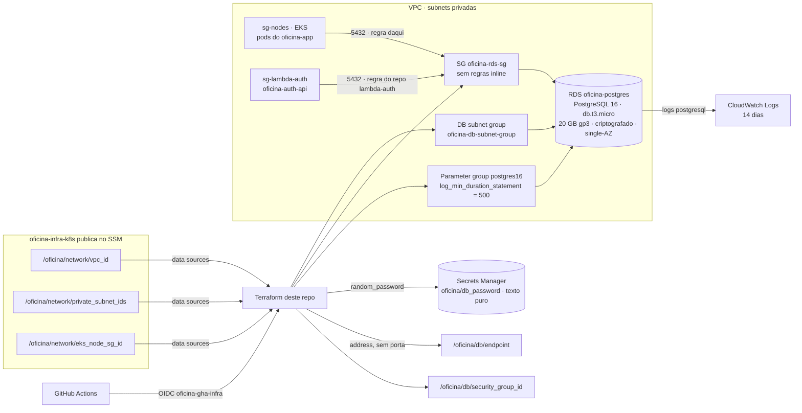

# Oficina Mecânica — Banco de dados (`oficina-infra-db`)

> **Tech Challenge — Fase 3 — Pós-Tech FIAP (15SOAT)**

Terraform do **RDS PostgreSQL 16** da Fase 3: instância `db.t3.micro` (20 GB gp3, criptografada,
single-AZ, não pública) em subnets privadas, DB subnet group, security group com regras como
recursos separados, parameter group com `log_min_duration_statement = 500`, Performance Insights
(7 dias), logs no CloudWatch e senha gerada no `apply` e gravada em texto puro no Secrets Manager.

## Repositórios relacionados

| Repositório | Responsabilidade |
|---|---|
| [`oficina-app`](https://github.com/lcr-thiago-fernandes/oficina-app) | API .NET 8 em Kubernetes; documentação arquitetural central (`docs/`) |
| [`oficina-lambda-auth`](https://github.com/lcr-thiago-fernandes/oficina-lambda-auth) | Autenticação serverless (emissor único de JWT) e Lambda Authorizer |
| [`oficina-infra-k8s`](https://github.com/lcr-thiago-fernandes/oficina-infra-k8s) | VPC, EKS, ECR, NLB interno, API Gateway, VPC Link, New Relic; `scripts/bootstrap.sh` |
| `oficina-infra-db` (este) | RDS PostgreSQL 16 |

Contratos: [`docs/contratos.md`](docs/contratos.md) e
[`oficina-app/docs/contratos-entre-repositorios.md`](https://github.com/lcr-thiago-fernandes/oficina-app/blob/develop/docs/contratos-entre-repositorios.md).

## Documentação arquitetural

A documentação arquitetural da Fase 3 é centralizada no `oficina-app`:

| O quê | Onde |
|---|---|
| Design arquitetural | [fase3-design-arquitetural.md](https://github.com/lcr-thiago-fernandes/oficina-app/blob/develop/docs/arquitetura/fase3-design-arquitetural.md) |
| RFCs | [docs/rfc](https://github.com/lcr-thiago-fernandes/oficina-app/blob/develop/docs/rfc/README.md) |
| ADRs | [docs/arquitetura](https://github.com/lcr-thiago-fernandes/oficina-app/blob/develop/docs/arquitetura/README.md) |
| Diagrama de componentes | [componentes.md](https://github.com/lcr-thiago-fernandes/oficina-app/blob/develop/docs/arquitetura/diagramas/componentes.md) |

As decisões deste repositório estão registradas em `## Decisões e limitações registradas`, abaixo, e em
[docs/contratos.md](docs/contratos.md).

## Arquitetura



**Por que o SG do RDS não tem regras inline:** o `oficina-lambda-auth` acrescenta
`5432 ← sg-lambda-auth` neste mesmo SG a partir do state dele. Regras inline e separadas no mesmo
SG se apagam mutuamente a cada `apply`; por isso tudo aqui é `aws_vpc_security_group_*_rule`, e o
job `contratos` do CI reprova qualquer bloco inline.

## Recursos

| Arquivo | O que cria |
|---|---|
| `terraform/data.tf` | lê `/oficina/network/vpc_id`, `private_subnet_ids`, `eks_node_sg_id` do SSM |
| `terraform/rede.tf` | DB subnet group; SG `oficina-rds-sg`; ingress `5432 ← sg-nodes`; egress |
| `terraform/senha.tf` | `random_password` (32 alfanuméricos) → `oficina/db_password` (texto puro, `recovery_window_in_days = 0`) |
| `terraform/rds.tf` | parameter group `oficina-postgres16`; log group `/aws/rds/instance/oficina-postgres/postgresql`; `aws_db_instance.oficina` |
| `terraform/ssm.tf` | `/oficina/db/endpoint` (só hostname) e `/oficina/db/security_group_id` |
| `terraform/outputs.tf` | endpoint, porta, banco, usuário, SG, nome do segredo, comando para ler a senha |
| `scripts/verificar-contratos.sh` | grep dos contratos (job `contratos`) |
| `scripts/setup-branch-protection.sh` | proteção de `main` e `develop` |

## Ordem de provisionamento da Fase 3

```
1. oficina-infra-k8s/scripts/bootstrap.sh   (local, uma vez: bucket + lock do tfstate, OIDC, role oficina-gha-infra)
2. oficina-infra-k8s                        → publica /oficina/network/*, cria roles e segredos compartilhados
3. oficina-infra-db   (este)                → RDS; /oficina/db/endpoint, /oficina/db/security_group_id; oficina/db_password
4. oficina-lambda-auth                      → /auth/*, authorizer, ANY /api/v1/{proxy+}; regra 5432 ← sg-lambda-auth no SG daqui
5. oficina-app                              → imagem no ECR + kubectl apply (hml/prd); migrations criam os schemas
6. THROTTLING_AUTH_HABILITADO=true no oficina-infra-k8s + re-executar o CD dele em main
```

Este repositório **depende** do passo 2: sem os parâmetros `/oficina/network/*` o `plan` falha
no data source (esperado). Custo do RDS: ~US$ 15/mês (dentro dos ~US$ 196/mês do conjunto).

### Destroy

Ordem inversa: `oficina-app` → `oficina-lambda-auth` → **`oficina-infra-db`** → `oficina-infra-k8s`.
Destruir este repositório antes do `lambda-auth` falha: a regra `rds_recebe_da_lambda` (state do
lambda-auth) ainda referencia o SG. `skip_final_snapshot = true`, `deletion_protection = false` e
`recovery_window_in_days = 0` garantem que o `destroy` termina sem sobras — e que os dados somem.

```bash
terraform -chdir=terraform destroy
```

## Bootstrap

Não há bootstrap aqui. O script vive no `oficina-infra-k8s` (`scripts/bootstrap.sh`) e já cria a
role `oficina-gha-infra` com trust para **este** repositório (`main` e `develop`). Depois de rodá-lo:

```bash
gh secret set AWS_TERRAFORM_ROLE_ARN --body "<arn impresso pelo bootstrap>" --repo lcr-thiago-fernandes/oficina-infra-db
```

## Deploy

| Branch | Ação do CD |
|---|---|
| `develop` | `terraform plan` |
| `main` | `terraform apply` + imprime `db_endpoint`, `db_security_group_id`, `db_engine_version_actual` |

Secrets do GitHub: `AWS_TERRAFORM_ROLE_ARN`. Variables: `AWS_REGION=us-east-1`. **Não há**
`DB_PASSWORD`: a senha nasce no `apply`.

Manual, da máquina (AWS CLI configurada com uma identidade que possa criar RDS/SSM/Secrets):
```bash
terraform -chdir=terraform init
terraform -chdir=terraform apply -var-file=local.tfvars    # opcional; copie de exemplo.tfvars
```

## Como conectar

O RDS não é público. A partir de um pod no cluster (ou de uma Lambda na VPC):
```bash
HOST=$(aws ssm get-parameter --name /oficina/db/endpoint --query Parameter.Value --output text)
SENHA=$(aws secretsmanager get-secret-value --secret-id oficina/db_password --query SecretString --output text)
kubectl -n oficina-prd run psql --rm -it --image=postgres:16 --env="PGPASSWORD=$SENHA" -- \
  psql -h "$HOST" -p 5432 -U oficina_admin -d oficina
```
Comando ad-hoc para demonstração: a senha entra no spec do pod (visível a quem tem `get pod` no namespace) e no histórico do shell; o `--rm` apaga o pod ao sair.

Queries acima de 500 ms: CloudWatch Logs, log group `/aws/rds/instance/oficina-postgres/postgresql`.

## Decisões e limitações registradas

1. **Descoberta pelo SSM, não por tag** (D1): o `oficina-infra-k8s` publica `/oficina/network/*`; o SG dos nós do módulo EKS não carrega a tag que o design supunha. Ver [RFC-004](https://github.com/lcr-thiago-fernandes/oficina-app/blob/develop/docs/rfc/RFC-004-topologia-quatro-repositorios.md).
2. **Senha por `random_password`, alfanumérica, sem GitHub Secret** (D2): o CD do `oficina-app` concatena `Password=` sem aspas; `manage_master_user_password` gravaria JSON em outro nome. Ver [RFC-002](https://github.com/lcr-thiago-fernandes/oficina-app/blob/develop/docs/rfc/RFC-002-banco-rds-postgresql.md).
3. **SG sem regras inline; egress liberada** (D3): SG compartilhado com o `lambda-auth`. Ver [RFC-002](https://github.com/lcr-thiago-fernandes/oficina-app/blob/develop/docs/rfc/RFC-002-banco-rds-postgresql.md).
4. **`insecure_value` nos data sources SSM** (D4): identificadores não são segredos; `value` esconderia o plan.
5. **Logs `postgresql` no CloudWatch com log group pré-criado, 14 dias** (D5): dá utilidade ao `log_min_duration_statement`; acréscimo ao design, removível.
6. **`engine_version = "16"` + `auto_minor_version_upgrade`** (D6).
7. **`rds.force_ssl` no default** (D7): consumidores negociam TLS com `SSL Mode=Prefer`.
8. **CI sem `plan` em PR; CD `develop → plan`, `main → apply`; sem bootstrap próprio** (D8).
9. **CD vermelho até o `oficina-infra-k8s` ser aplicado** (D9) — esperado.
10. **Performance Insights em `db.t3.micro`** (D10): suportado para PostgreSQL; conferir no primeiro `apply`.
11. **Nomes `oficina-postgres`, `oficina-rds-sg`, `oficina-db-subnet-group`, `oficina-postgres16`** (D11).
12. **aws `~> 5.60`, random `~> 3.6`, Terraform ≥ 1.10; Dependabot ignora majors** (D12).
13. **Nada foi aplicado ainda**: `terraform validate` verde; o primeiro `apply` real pode revelar ajustes (PI na classe, minor disponível da 16, família do parameter group).
14. **Sem `multi_az`, `backup_retention_period = 1`, sem snapshot final**: ambiente de demonstração destruível; não é postura de produção.

## Licença

Uso acadêmico — FIAP Pós-Tech 15SOAT.
